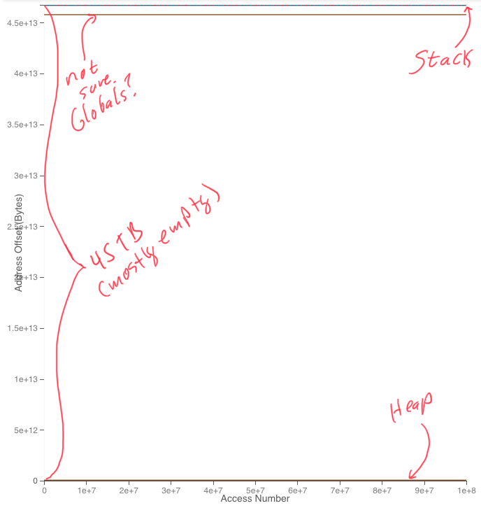

# The Data Structure Zoo and the Tour de Cache

This lab has two parts.  The first is a series of excercises to
explore the memory behavior of a variety of different programs.  The
second, is the Tour de Cache -- a programming assignment in which
you'll push the processor to it's limits in unusual ways. 

This is a two week lab with a checkpoint at the end of the first week.
You should start the Tour de Cache early.  It requires a lot of
experimentation and thought.

Check gradescope for due dates.

This lab will be completed on your own.

## FAQ and Updates

Watch here for answers to FAQs and notifications about important updates.

1. Removed mentions of `*.inst_mix.csv`.  You don't need it.
2. Revised suggested order for Part 2 to reflect what was covered in lecture.
3. Added some advice about getting started.
4. Added a Common problems section and how to resolve them when moneta tags don't show up.
5. Clarified problem 6.
6. Replaced references to `fp_add` with `fp_sum`.
7. Added text describing new features in the lab under "Tasks To Perform"
8. Added a note about how to approach MCMPS.

## Integrated Worksheet and README

**READ THIS CAREFULLY**

We are integrating the worksheet into the README.  You should use the provided `README.pdf` to fill in your answers for this lab.  **You should not generate your own pdf**, since the formatting may not match.

As bugs are found in the lab, we may update `README.md`.   We **will not** update `README.pdf` so we can ensure that everyone is using the `README.pdf` to submit answers.

We will maintain a FAQ/important updates section at the top of `README.md` *and* incorporate changes into the body of the markdown document only.

## Annotating PDFs

We realize that marking up PDFs is kind of terrible, but it's the best solution we've found to the problem of submitting and grading these labs (we have considered, many, many alternatives and none of them work well for all students).  To make it as easy as possible, here are some options.

**Option 1**: Print it out, handwrite the answers, and then scan it as a PDF.

**Option 2**: Write in the PDF itself using either text-based or freeform (e.g., writing with a tablet) annotation tools.

**Option 3**: Convert the homework PDF to images and use those images as backgrounds in Word or LaTeX or Google Slides (Google Docs doesn’t really support background images). Type on it, then save it as a PDF.

You can try exploring the following resources to edit pdfs to fill in your Homework Solutions.

1. https://www.pdfescape.com/open/
2. https://simplypdf.com/
3. https://www.foxitsoftware.com/

## Keeping Your Repo Up-to-Date

Occasionally, there will be changes made to the base repository after the 
assignment is released.  This may include bug fixes and updates to `README.md`.  

In those cases, you can use the following commands to pull the changes from upstream and merge them into your code.

```
runlab --check-for-updates
runlab --merge-updates
```

## Grading

| Part                       | value |
|----------------------------|-------|
| Part 1                     | 40%   |
| Part 2                     | 20%   |
| Tour de Cache autograder   | 40%   |

Part 1 of `README.pdf` is due after the first week.  You can turn it in late for
75% credit.  We will only grade one submission for Part 1.

Part 2 and the Tour de Cache autograder assignment are due at the end of week 2.  No deadlines or extensions will be allowed.

Note that you will submit _the entire_ `README.pdf` (don't remove any pages) for Part 1 *and* Part 2.  For the Part 1 submission, we will only grade Part 1.  For the part 2 submission will we will only grade Part 2.

Please check gradescope for exact due dates.

See the Tour de Cache section below for details on how that part will
be graded.

---
# Part I Starts here
--- 

## The Data Structure Zoo

### Linked Lists vs. Vectors vs. Hash Tables vs. Trees

First, we'll take a look at the memory behavior of several different data
structures.

As a test application, we'll consider the problem of summing a collection of floating point values.  We'll discuss some of the weirdness of floating point numbers later in the course, but one oddity is that the order in which you add FP numbers together affects the result.  To ensure an accurate sum, it's best to add the numbers in increasing size.

In this lab you will run this algorithm for floating point values stored in four different datastructures from the C++ STL: `vector`, `list`, `set`, and `unordered_set`. 

Take a look at the file `fp_sum.cpp`. It contains functions to fill the structures with random floating point values and sum them. It also contains the `DUMP_START` and `DUMP_STOP` tags for each of the structures to be visualized in Moneta. Running `make fp_sum.exe` will generate the executable file.

While running the executable, the data structure to be used can be specified with `--datastructure` argument. The accepted datastructures are`list`, `vector`, `set` or `unordered_set`. The number of floating point values can be specified with the `--size` argument. For this lab, we will run with 4096 floating point numbers.

For your own reference, search the internet to figure out which data structure is used for each of these C++ data types.  Different versions of the STL might use different structures.  We are using the STL that ships with GCC 8.  You can fill in this table if you want (this isn’t graded).

|C++ Type | underlying data structure |
|---------|---------------------------|
|`stl::list` |                         |
|`stl::vector` |                         |
|`stl::set` |                         |
|`stl::unordered_set` |                         |

Your first task is to collect traces for each data structure.  Here's the command line for vector:

```
make fp_sum.exe
mtrace --trace fp_sum_vector -- ./fp_sum.exe --datastructure vector --size 4096
```

It will generate two things:

1.  A trace you can view with Moneta (`trace_fp_sum_vector.hdf5`, ` meta_data_fp_trace_vector_0.txt`, and `tag_map_fp_sum_vector.csv`)
2.  A file of statistics that Moneta collected (`fp_sum_vector.stats.csv`).

Can view the `.stats.csv` at the terminal with:

```
pretty-csv fp_sum_vector.stats.csv
```

Which will give you something like this (Don't use this data, it's not correct):

```
app   |file_no|m_cache_lines|m_cache_line_size|m_cache_size|m_inst_count|m_hit_rate|m_miss_per_inst
------|-------|-------------|-----------------|------------|------------|----------|---------------
fp_sum_vector|1.0    |5.12e+02     |64.0             |3.28e+04    |7.48e+06    |0.998     |0.000286
```

The first few columns contain information about the configuration.  The last three columns have cache performance metrics as measured by Moneta (hence the 'm_' prefix).


---

**Note:** If you get an error like this: 
```
terminate called after throwing an instance of 'H5::FileIException'
```
You just need to delete `trace_fp_sum_vector.hdf5` and rerun `mtrace`


---

When you run the executable locally on your machine or on DSMLP you may get an error message with starts like this and is followed by a list of supported processors

```
Error: unsupported processor. Only Intel(R) processors are ...
```
This error message is because performance counter measurements cannot be made on local machine or DSMLP, but the code will still run functionally and produce the right sum value and memory traces. For performance measurements use `runlab --run-git-remotely -- <your command here>` or submit to autograder.

---
Make sure you are connected to campus VPN.  Connect to `dsmlp` and invoke `launch-142 -m 8` (the `-m 8` gets you some more memory to keep Moneta from crashing so much).

Start Moneta. On DSMLP, it is similar to what you did in Lab : [Launching Moneta]( https://github.com/CSE142/sp21-CSE142L-caches-I-starter#launching-moneta). A trace named "fp_sum_vector_0" should be visible in the Trace section of the UI. That is the trace you just generated. Click "Load Trace" to load it.

---
**Pro Tip**

When you open a Moneta trace in almost always looks like this:



The thin, horizontal lines, represent the major memory regions in the program.  Despite appearing quite tiny, each line might represent large amounts of data -- the 'y' axis spans ~45TB (45x10^12 bytes).  You will need to zoom in quite a bit to see details!

The line along the bottom is the heap (memory allocated by `malloc()` or `new`).  The line at the top is the stack (recall that it grows down).  I'm not certain what the line below that is.  Any ideas?

If you zoom in on one of the lines you may they are actually made up of several lines.  Zoom in far enough and you'll see more detail.

Sometimes, however, you'll see a single colorful line along the bottom of the display, and the vertical axis will cover a much larger span (like 1.8x10^19).  In this case, zoom in on the single line and you should see the three lines described above.

--- 
Look around the trace and find the array being sorted.  It make take some searching.   Here are some tips for searching in Moneta (refer to the May 3 lab lecture video for a demo):

1. Think carefully about what you are looking for.  Look at the source code for `fp_sum.cpp`.  How big do you expect the array to be?  What should initializing an array look like in Moneta?
2. Systematically look at each of the horizontal lines that appears in Moneta.  Zoom in on each.
3. Pay attention to the vertical axis it shows how many bytes of memory you are looking at.  When you are zoomed out too far, a horizontal line could be anything (since it's too thin to show any detail).  When you are zoomed way in, a horizontal line is a repeated access to one memory location.
4. If you are having trouble, you could add more `START_DUMP()` calls to `fp_sum.cpp` and use them to narrow your search.
5. Use the the checkboxes next to the tags to toggle things on and off. It's a good way to figure out what's what.

Next, find the stack.  It's the top most line in the Moneta plot.  

Here are two hints to help you find the stack:

1.  The sorting algorithm for `vector` is recursive.
2.  The stack grows down.

It can be challenging to correlate behavior in the heap (e.g., the contents of the vector) and the stack.  The easiest way to do this is to find the part of execution you are interested in (e.g., sorting) by looking at the heap and note the range of the x-axis.

Then, zoom all the way back out and zoom into the stack for the same region of the x-axis.

As you look at the traces, here are some questions to think about **Don't submit answers to these**: 

1.  What do accesses look like? 
2.  How much locality do you see?
3.  Can you identify the different phases of execution (initialization vs. sorting vs. summation)? 
4.  How does the stack behavior vary between the two phases. Why?

Collect and explore traces for `list`, `set` and `unordered_set` as well.  Be systematic with how you name the files, so you'll know what's what.  I suggest something like `fp_sum_set`, `fp_sum_vector` etc.

--- 

**Note:** Pay close attention to the end of your `mtrace` command.  If it ends with something like 

```
Exiting application early
Collected 10000000 memory requests
```
You can pass `--memops 20000000` (or some other value) to allow the creation of larger files (which might make the Moneta viewer crash more frequently) or `--file-count 2` which will break up the trace across multiple (in this case 2) files.  You'll have to load and view them separately. Please note that `--memops` and `--file-count` are mtrace arguments and not arguments to the executable. For example, to increase the memops, the new command line should look like this:
```
mtrace --trace fp_sum_vector --memops 20000000 -- ./fp_sum.exe --datastructure vector --size 4096
```

---


If you name the files consistently like that, you can run this command to get a nice summary of the data for all the workloads:

```
merge-csv fp_sum*.csv | pretty-csv -
```

Next, we'll collect performance counter data.  This needs to run in the cloud, so you'll use `runlab` to invoke a make target:

```
runlab --run-git-remotely -- make fp_sum_vector.perfcount
```

This will generate  `fp_sum_vector.l1.csv`.

`.l1.csv` contains the L1 cache performance counters.   You can collect the data for the other data structures by replacing `vector` with the other datastructures `list`, `set` and `unordered_set` in the command above.

You now have a trove of data about how all the versions of the program behave.

Try 

```
merge-csv fp_sum*.csv | pretty-csv -
```

to get all the data in one place.

### Common Problems

#### Moneta tags not showing up

There could be several reasons why your newly added tags aren't showing up in moneta. Here are some of the common pitfalls and how to avoid them:

1. Make sure you recompile your code after making changes, and that it compiles successfully. Run `make fp_sum.exe` after you update `fp_sum.cpp` and check that there are no errors. Otherwise you're simply running the older version of the executable which most likely doesn't have the tags you added!
2. If you added the `--file-count` argument to mtrace, it splits the trace across multiple files. Perhaps the tags you added are in another trace file? Make sure you load the other trace files and check them for your tags.
3. The moneta tags show up only if there are accesses to the address range specified in the `DUMP_START` function. In case you're not sure how to get the addresses, simply use the `DUMP_START_ALL` function! It makes your life easier by tagging all the accesses within the calls to `DUMP_START_ALL` and `DUMP_STOP`. An example usage is:

```
DUMP_START_ALL("mynewtag", false)
<... lines of code ...>
DUMP_STOP("mynewtag")
```

Now answer the questions below. These are graded.

#### P1 (8pt) Insert a screen shot from Moneta of the data accesses for each datastructure. Annotate your screenshots as follows:

* For `vector` and `list`, draw a circle or box and label the initialization, sorting, and summing phase. (Instead of a circle you could pick any other shape you prefer as long as that clearly encloses the phase)
* For `set` and `unordered_set` circle and label the initialization and summing phases.  

The screenshots should be zoomed in on the region of memory that each datastructure occupies.

```


    List


```

```


    Vector


```

```


    Set


```

```


    Unordered Set


```

#### P2 (2pt) Is the algorithm used to sort the list implemented via recursive function calls? How can you tell?  Provide a screen capture of the evidence you found and how it supports your conclusion.
```


```

#### P3 (2pt) Is the algorithm implementation to sort the elements of the vector same as the one used for list? How can you tell? Provide a screen capture of the evidence you found and how it supports your conclusion.
```


```


#### P4 (2pt) We would like to see how closely do the cache hit/miss rates in the moneta traces match with the performance counter numbers (L1 only). For this, make a scatter plot with moneta misses per instruction on x-axis and perfcount misses per instruction on y-axis. Is there a pattern? If so, describe it. (Make sure your graph is properly labeled and legible.)

```


```

 
#### P5. **Challenge Question** (2 points) According to [Geeks For Geeks](https://www.geeksforgeeks.org/sort-algorithms-the-c-standard-template-library-stl/): 

> In more details [the std::vector sorting algorithm] is implemented using hybrid of QuickSort, HeapSort and InsertionSort.  By default, it uses QuickSort but if QuickSort is doing unfair partitioning and taking more than N*logN time, it switches to HeapSort and when the array size becomes really small, it switches to InsertionSort.

**Use Moneta to identify where STL's sorting algorithm, that is used to sort a `vector`, shifts from QuickSort to InsertionSort?  What is this size? Provide a screen capture of the evidence you found and how it supports your conclusion.**

```


```

### Lists in Python

---
**Pro Tip**

Memory traces for python are messy.  There's a lot going on in the interpreter!  Some things to keep in mind:

1. Python is reasonably efficient.  The operations for doing something like initializing an array will look basically like it did in C++.
2. You can modify and trace `list.py` however you like to gain understanding of what's going on.
3. It will take some searching to find what you need.
4. The `sort` method for a Python list sorts the items _in place_.

---

Moneta can trace Python code as well. Take a look at `list.py`.
It implements the same algorithm as above. Also note the Python versions
of the moneta commands such as `START_TRACE` etc.  These are just Python wrappers around the
C++ versions of those functions.

Generate the trace of the file using the following command:

```
mtrace --memops 70000000 --trace python_list -- python list.py 1000
```

The argument 1000 specifies the size of the array.

At the end of the of the output it says something like (values could be different):

```
Sum of list: 0.8373731095805994
Collected xxxxxxxx memory requests
```

Make a note of the `xxxxxxxx` value.  Then run `mtrace` with a different trace name and change the command line argument for array size from 1000 to 1.  How many memory requests did it execute?  

#### P6 (1 Point) What fraction of memory requests in the trace of `python list.py 1000` are actually related to doing the computation (i.e., the initialization, sorting, and summing)?

```


```

Open the trace for size `1000` in Moneta and answer the following problems.  Please note the useful tags we've provided in `list.py`.  Use them.  They will make the following problems much easier.

#### P7.  (2 points) Provide a screen capture of the stack during the execution of `list.py`.

```


list.py's stack


```


#### P8: (2 Points) Provide a screen capture of the portion of the heap that holds the array.  Label the initialization phases, sorting, and summing.

```


```

##### P9: (2 points) Based on the traces and by comparing the results `fp_sum.exe --datatstructure list` and `fp_sum.exe --datastructure vector`, does Python use arrays or linked lists to store its lists?  How can you tell?   Point to specific evidence from in the screen capture above.

```


```

#### P11: (2 points) Python uses [Timsort](https://en.wikipedia.org/wiki/Timsort) for sorting.  Timsort is based on merge sort and insertion sort.  For small segments of the array, it uses insertion short.   Provide a screen capture of a portion of the Moneta trace showing a portion of the execution that is performing insertion sort.

```


```


---
# Part II Starts Here
---

## Tour De Cache


In this lab you will compete in the Tour de Cache!  The world's most famous and longest-running contest for optimizing unusual metrics for processor performance.

In the Tour de Cache, you'll be writing programs to elicit unusual
behavior from the processor.  The goal is make you think carefully about
how the code you write translates into assembly code and then into
processor behavior.  It requires careful thought, studying the
compiler's output, and some experimentation. **Please start early.**

You will write functions to compete in four events:

1.  **IPC** -- Maximize IPC
2.  **MCMPS** -- Maximize cache misses per second(Mega Cache Misses Per Second)
3.  **MBMPS** -- Maximize branch mispredictions per second. (Mega Branch Mispredictions Per Second)
4.  **All around** -- Write code that simultaneously does all of the above.


### Grading

There are two parts to the grading for the Tour De Cache: Worksheet 2 and autograder (See the top of this file for the breakdown).  The first is the questions at the end of this section.

The second is based on the combined score on each function.  The score for a function is the fraction of the target values you achieve for each . The target values are below:

| Event          | Target Value |
|----------------|--------------|
| IPC            | 4            |
| MCMPS          | 6            |
| MBMPS          | 70           |
| All around     | 100          |

So, if you achieve an IPC of 3, your grade (out of 100) will be
```
(3/4)*100 = 75
```
Depending on how things go, we may lower (but will not raise) the
target values.  This will only help you.

The units for the first 3 are self-explanatory.  For the All-Around,
the score is the product of the IPC, MBMPS and MCMPS value. It would be hard to
get 4*6*70 for the all_around thus we set the target to 100. This is
not a meaningful metric, but it conveniently gives equal weight to IPC
, MCMPS and MBMPS.

Your final score on the lab is the mean of your scores on each
event.


### Rules

1.  C/C++ only (no assembly)
2.  Any compiler flags you want (in `config.env`).
3.  Each function must run for at least 4 second.
4.  All together your functions should not run for more than 45 seconds.
5.  No making system calls (i.e., no threads, no `sleep()`)
6.  No library calls of any kind (except `malloc()` or `new`).  You should only run code of your own with the exception of `fast_rand()`.  You can use `cout` for debugging, but not in your submissions.

### Skills to Learn and Practice

1. Debugging performance problems.
2. Measuring pipeline behavior with perf counters.
3. Analyzing assembly code.
4. Reasoning about processor pipeline behavior.

### Software You Will Need

1. A computer with Docker installed (either the cloud docker container via ssh, or your own laptop).  See the intro lab for details.

2. The lab for the github classroom assignment for this lab.  Find the link on the course home page: https://github.com/CSE141pp/Home/.

3. `runlab --run-git-remotely` --  Your score on this lab is based on the performance of code running in the cloud.

4. You can use Moneta if you want.  It may or may not be helpful.  Please keep in mind that the cache performance numbers that Moneta reports are not always accurate. You may need to include moneta in the file you want to use moneta on.

### Measuring Performance

The value for the metrics is based on performance counter measurements, so they must be done in the cloud.  `TourDeCache.csv` will hold your results.   To generate good results, you must do `runlab --run-git-remotely` (or submit via GradeScope).

The basic command line to run is  

```
runlab --run-git-remotely
```

### A Word of Advice and Warning

The lab requires three things:

1. Carefully thinking about how your code will run on a real CPU.
2. Study of the assembly out of the compiler to confirm your intuition from #1.
3. Experimentation and iteration across 1 and 2 to find a good solution.

If you focus on #1 and #2 with a bit of #3, you can complete this lab
in a few hours.  If you focus on #3 and ignore 1 and 2, it will take a
very long time to complete, and it will be enormously frustrating.

We have observed a tendency among our students to focus on #3 because
it seems easier.  We urge you, in the strongest possible terms, to
avoid this temptation.

To encourage you to think before you code, the write up for this lab
requires you to explain, in terms of what we discussed in class, why your
code performs the way it does. 

### Tasks to Perform

#### Examine the Starter Code

You'll find four source files: `MBMPS.cpp`, `IPC.cpp`, `MCMPS.cpp`, and
`all_around.cpp`.  There's one function in each one.  That's the
function you should modify.

Those functions are currently empty.  You can fill them with anything
you want as long as it adheres to the rules above.  A good way to
start is with a simple loop.  Run it, see what it gets, and then add
something that you think might improve the metric that function should
be maximizing.

What should you add?  Think about what we've learned in lecture about
the pipeline and what factors influence each of the metrics.  What
leads to high IPC (i.e., low CPI)?  What leads to lots of branch
mispredictions?  Which of these factors can be influenced by
the program (rather than being the result of, for instance, the clock
speed)?

The questions for MCMPS and MBMPS are pretty simple:

1.  MBMPS:  How do you create a branch that is as unpredictable as possible and execute it as fast as possible?

2.  MCMPS: How do you generate a sequence of memory accesses that cause as many misses as quickly as possible?

So, start with a program has what's needed to affect the metric (e.g., a memory operation or branch that executes many times).  Look at the assembly output.   Measure performance.  Think about the results.  Try something new.  

Keep it simple.

#### Practice Running Individual Events

The code in `tourDeCache.cpp` provides command line arguments to run a subset of the events.  For instance:

```
tourDeCache.exe --function IPC
```

will just run `IPC`.

Running `tourDeCache.exe` on `dsmlp` is not useful, since there are no performance counters, but you can also use these command line options with the `EXPERIMENT_CMD_LINE_ARGS` variable in `config.env`.  For instance, setting

```
EXPERIMENT_CMD_LINE_ARGS=--function IPC
```

in that file and then running:

```
runlab --run-git-remotely -- make experiment.csv
```

Will run `IPC` on the autograder.

Please note that if you want to the actual metrics for the event,
you'll need to copy part of the value of `TOUR_DE_CACHE_CMD_LINE_ARGS`
to `EXPERIMENT_CMD_LINE_ARGS` in `config.env`.

#### Practice Generating Assembly code

There's a new `make` target: `make asm` that will just build the `.s`
files for your code.  If you get tired of waiting you can do `make -j4
asm` to compile everything at once.

#### Learing To Collect Instruction Mix Data

If you add `--stat-set inst_mix.cfg` to `EXPERIMENT_CMD_LINE_ARGS` you
can get information about what fraction of the program is memory
operations, branches, etc.  Due to hardware restrictions, you can't
collect all this information _and_ compute the metrics we need for the
events during the same run.

### How To Approach Each Event

#### Getting Started with IPC

We'll go through an example in class on Monday.

#### Thoughts on MBMPS

The branch predictor on our processor is very good, but it can't
predict branches that have no pattern.  We've provided `fast_rand()`,
a very fast random number generator.  Its output has no dicernable
pattern, so how can you make branches based on its output as quickly
as possible?  Keep in mind that sometimes, the compiler may be very
clever in how it implements `if` statments.  Check the assembly to see
what the compiler is actually doing.

---
**Pro Tip**

In many performance measurement tasks, generating random numbers can be useful.  The standard random number generators are suprisingly slow, which can distort your measurements.

You can use `fast_rand()` to generate randomish numbers quickly: 

```
uint64_t fast_rand(uint64_t * seed);
```

Check `IPC.cpp` for help on `fast_rand` usage. The numbers are random enough for most purposes.  You pass it a 64-bit value (seed) which it uses to compute the next random number.  It then updates the value you passed it and returns the value.  So this code prints out a sequence of random numbers forever:
 
```
#include <archlab.h> // "/course/cse141pp-archlab/libarchlab/archlab.h"
...
{
    uint64_t seed = 4; // must be non-zero.
    while(true)
        std::cerr << fast_rand(&seed) << "\n";
   
}
```

---

#### Thoughts on MCMPS

The cache on our process is 32KB. It's 8-way associative, and has 64B lines.  Starting by thinking about cache line size and total capacity.  Associativity is a second-order concern.

I would think about this as two separate tasks.  The first is to issue as many memory accesses as quickly as possible.  The second part is how to ensure that as many of them as possible are misses.

The lecture slides/video have quick intro to memory-level parallelism (which is what you want to maximize) and our lectures about the cache hierarchy will remind you about spatial and temporal locality (which is what you want to minimize).

#### Thoughts on all_around

How can you blend all of the above?  Perhaps one of the above
solutions is a good starting point.  Then, you'll have to balance the
effects of changes to one metric on the others.

#### How to Proceed From Here

We recommend working in this order: `MBMPS`, `MCMPS`, `IPC`, and `all_around`.
It's just a suggestion.  You should definitely do `all_around` at the last.

### Optimize the Metrics

The best approach to the Tour de Cache is a combination of
thinking, investigation, and experimentation.

#### Thinking

Based on what you've learned about how the pipeline, caches, and branch prediction works, how can you get
behavior each event calls for?

#### Investigation

Look at the assembly!  Doing well on these events demands that you
look at the assembly to make sure it's doing what you expect.  You can generate assembly for `foo.cpp` with `make foo.s`.

#### Experimentation

For the best results, try several different approaches.  Be open to
surprising results and pursue them.  Try simple things.

---
**Pro Tip**

You can build `.s` file for `IPC.cpp` by doing `make IPC.s`. Similarly for other files.  If you're compiling C++, use `c++filt` to make the output more readable:

```
c++filt < IPC.s | less
```

Typing `/<function_name>` will search for your function.

---

#### Basic Alogrithm for Doing This Lab

```
for e in [MBMPS, CMPS, IPC, all_around]:
    think_about_what_the_event_requires(e) # Think in terms of what you need instructions to do (e.g., a banch to mispredict a lot)
    s = simplest_possible_solution(e) # Something that has what's necessary to affect the target metric (e.g., a branch that executes a lot)
    best_solution = s
    best_perf = 0
    while(!satisfied_with_performance(s, e)):
        asm = `make e` + ".s"
        look_at(asm)
        if (looks_like_you_think_it_should(asm)):
            perf = measure_perf(s, e)
            if perf > best_perf:
                best_perf = perf
                best_solution = s
        think_about(s, perf, e)
        s = improve(s, e)
```

In summary:
1.  Start small.  Try something!  Try several things!
2.  Look at the assembly a lot.
3.  Iterate quickly.
4.  Keep it simple.

### Tips

* Start simple, and add complexity slowly.  Check your performance and
  your assembly frequently.  Starting small will make it easier to figure out what's going on _and_ make it easier understand the assembly.

* The results for all 4 metrics for all 4 functions are in the output
  of your `runlab` run (`tourDeCache.csv`).  Sometimes a function built for one will be
  unexpectedly good at another.

* Your functions need to fit within the time constraints given for
  your data to show up on the leaderboard, but you can see the stats
  regardless.  Get your scores up and then tune the runtime.

* Look at your assembly!  Doing well at the Tour de Cache requires
  close control over what instructions are executing.  In this case,
  the compiler may not cooperate.

* You can keep the compiler from optimizing out variables (or accesses to variables) by declaring
  them `volatile` (e.g., `volatile int i;`).  This will force the variable into memory.

* You can encourage the compiler to keep a variable in a register by
  declaring it `register`.  For instance: `register int i;`.

* `cmov` is a 'conditional move'.  It moves a value into a register
  depending on the value of a condition code.  This can get rid of
  branches (e.g., in `if (foo) x = 2*y else x = 2*z;`}, but it increases IC
  because the program must run both the `if` and `else` parts.

* Shorter code is generally better.  A few carefully crafted lines
  will outpeform a complicated mess.  We have very good solutions that
  are all less than 15 lines long.

* If you notice the compiler is doing something clever and messing up your plans, try making
  your code a little more complicated to confuse it (`volatile` is
  often helpful).

* Type conversions (e.g., assinging an `int` to a `long int`) turn
  into `mov` instructions.

* Use `long int` or `unsigned long int` for your loop indices.  You
  will probably be using very large loop bounds, and if you exceed
  MAXINT, the compiler may "optimize" your long-running loop into an
  infinite loop (Challenge ungraded question: This optimization is legal. Why?)

### Common Errors
 
#### Autograder Fails

```
The autograder failed to execute correctly. Contact your course staff for help in debugging this issue. Make sure to include a link to this page so that they can help you most effectively.
```

This usually means you are printing a massive amount of output in one of your functions.   You shouldn't be printing anything.

####  tourDeCache.csv missing

This means your program crashed or couldn't build.  Look further up in the output for another error.

#### Failed Because Earlier Errors

```
This test was skipped because 1 prior errors occurred.
```

This means some earlier test failed.  For instance, you code didn't run
long enough.  Or the canary failed.  Look up above for an earlier error.


### Questions

1.  For each function you wrote provide an explaination to your code. In your answers you should reference specific aspect of the pipelines behavior and design that result in behavior you observed. Each answer must fit in the space available. You can draw diagrams or write text or both.

 ```


    IPC


```
```


    MCMPS


```
```


    MBMPS


```
```


    all_around


```
2.  For each event, explain one approach you tried but that didn't work.
```


    IPC


```
```


    MCMPS


```
```


    MBMPS


```
```


    all_around


```
3.  For IPC and MBMPS, provide a before and after comparison of a change that improved performance. Show the assembly code and the assembly code of the function(don't put the whole `.s` file here) before and after the changes. Describe why the new assembly is better for the metric. 
```


    IPC 
    (here you should have four pictures
     - old IPC.cpp
     - old assembly
     - new IPC.cpp
     - new assembly)


```
```


    MBMPS 
    (here you should have four pictures
     - old MBMPS.cpp
     - old assembly
     - new MBMPS.cpp
     - new assembly)


```
